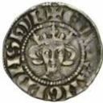
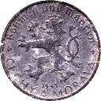
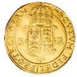
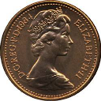

# CoinsDataset
Scraped dataset of ~2600 images of coins expanded to ~21000 with rotations and flips. The dataset is split 90% - 10% for training and testing.

# Instructions
1. Unzip folder.
2. Uncomment main lines at bottom of createDataset.py (all of them or one by one).
3. Run script to generate augmented dataset from original images. The dataset will be saved in "coins.h5" file as "X_train" and "X_test".

# Examples

